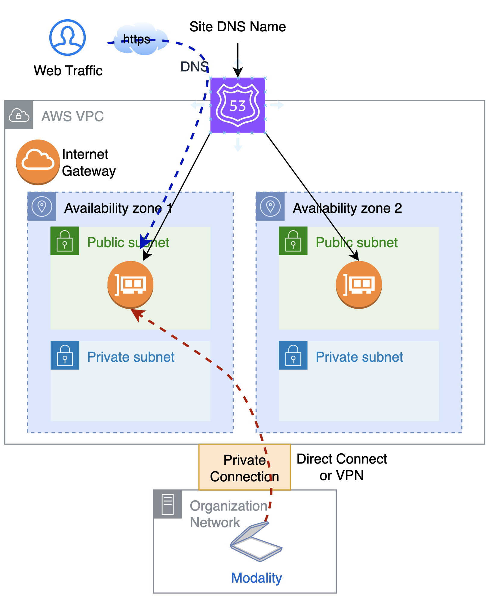
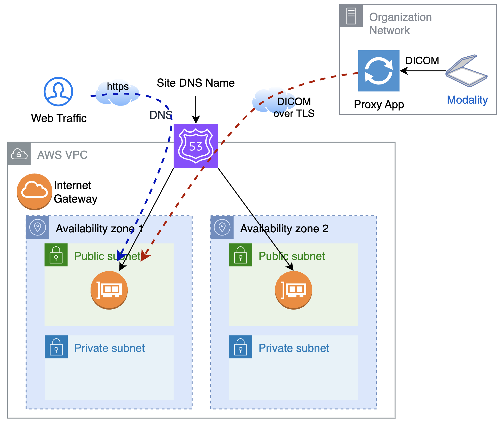

Device connectivity is another area of customization depending on the organization's network setup. 

Images with sensitive information are transferred in [DICOM protocol](https://dicom.nema.org/medical/dicom/current/output/chtml/part08/PS3.8.html). If they are transferred across the Internet, they must be encrypted with Transfer Layer Security (TLS). To configure secure DICOM transfer, both sides must support TLS. While this is configured by default in the orthanc solution, the modality side does not always have proper support for TLS.

As a result, users should not send DICOM images from modalities over the Internet to Orthanc without TLS configuration. If the modality does not support DICOM TLS configuration, consider the following ways to secure the transfer.

## Private Network Connection
At network infrastructure level, the organzation may build a AWS Direct Connect connection with AWS. Requirement for such network connection should be reviewed with the network team of the organization, and require collaboration of multiple teams.

  

Instead of private physical connection, user may build a private connection over the Internet using VPN.

## Virtual Private Network (VPN)
Compared with Direct Connect, VPN involves much less effort and cost. It comes with two models:

* Site-to-site VPN: requiring either a physical device or software application to act as a customer gateway. 
* Client VPN: requiring OpenVPN-based client on a workstation. Enable split-tunnel so only relevent traffic are routed to VPC.

If you're sending imaging data from a single workstation. You may connect the workstation to the VPN using client VPN. Orthweb does not automate this configuration. Follow [this instruction](https://docs.aws.amazon.com/vpn/latest/clientvpn-admin/cvpn-getting-started.html) to configure client VPN between the workstation and the VPC. Here are some supplementary notes:

1. the VPN client and the VPN endpoint use certificate based mutual authentication. Many use OpenSSL to create certificates but AWS instruction uses "easyrsa3" to create them.
2. When creating the VPN endpoint, specify a separate CIDR range for client IPs, e.g. `192.168.0.0/22` In this context, the client IP is the workstation's IP once it connects to the VPC via client VPN.
3. create a new security group (e.g. vpn-ep-sg) with outbound rule allowing all types of traffic to destination CIDR 0.0.0.0/0
4. When creating the VPN endpoint, associate it with the two private subnets as target network (which adds the required routes under the hood). Set vpn-ep-sg as the security group. Create the authorization rules as instructed.
5. Enable [split-tunnel](https://docs.aws.amazon.com/vpn/latest/clientvpn-admin/split-tunnel-vpn.html) for the VPN endpoint so other network features on the workstation are not impacted.

Once the VPC client software (OpenVPN or AWS VPN client) is configured and connected from the workstation, the connection between the EC2 instance and the DICOM client will become secured at the IP layer.

## Use a DICOM proxy
The organization may consider running a local DICOM proxy. The proxy receives images from modality in the clear, and forwards the images over the Internet to Orthanc. Unlike the modality application, such proxy applications usually come with full support of TLS. There are not many open-source options. An on-prem instance of Orthanc can be configured to act as a DICOM proxy.

  

In this configuration the DICOM port should also open. Use security group to restrict where the port can receive traffic.