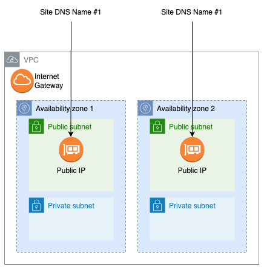
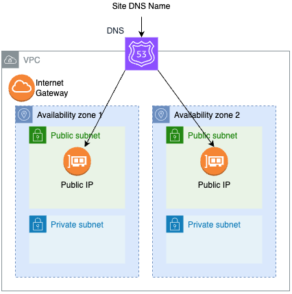
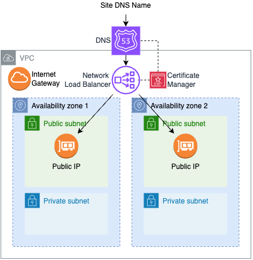

Ingress traffic management concerns with how external web traffic (and possibly DICOM traffic) reach the network interface of Orthanc EC2 instances. 

The Orthweb solution does not provide a prescriptive design pattern or implementation for ingress traffic management. This is because the requirements in this area often vary so significantly that no two organizations share the same design. 

This section discusses some possible customization options for ingress traffic management. Note, these patterns are not the only viable options. Please discuss the most suitable design with us.

## Out-of-box Configuration
The out-of-box configuration functions without ingress traffic management service. However, it comes with two difference DNS names, one for each EC2 instance, as illustrated below:

  

In this configuration, each EC2 instance lives in a separate availability zone. Both are connected to the same database (RDS) instance and storage (S3). In the event of an EC2 instance failure, the other instance is available. User may also choose to stop one of the instances for lower cost.

On each EC2 instance, the Nginx container listens to port 443 and proxies web request according to its configuration.

## Limitations
In most production scenarios, the out-of-box configuration is not convinient. First, the two EC2 instances have two separate DNS names. In the event that one instance becomes unavailable, users and modalities have to use the alternative site DNS name. Second, the DNS name is automatically created based on the public IP address. Users do not have control of the DNS names. Thrid, the DNS names end with `amazonaws.com`, which is not owned by the users, and therefore users are not able to create trusted certificates.

To bring the solution to produciton, it is recommended to introduce additional cloud resources to manage ingress traffic. The rest of the section discusses at very high level some options.

## Use Domain Naming Service (DNS)
Consider introducing a DNS service to point to both EC2 instances. The DNS resolution result determins which EC2 instance the client connects to. So each EC2 instance must still open 443 and 11112 ports. This pattern is illustrated as below:

  

In this pattern, the DNS can resolves to the public DNS name for both EC2 instances. The result of DNS resolution can rotate, round robin or based on availability. In this option you will bring your own DNS name, and manage your own TLS certificate, instead of using the self-signed certificate provisioned during automation.

It is also possible to integrate with Content Delivery Network (CDN, such as CloudFlare, CloudFront) for advanced features such as application firewall.

## Use Load Balancer (NLB or ALB)
As cost allows, consider placing a network load balancer in front of the EC2 instances. We would be able to configure the network load balancer so it automatically sends the traffic to a functional EC2 instance, thereby eliminating the manual fail over procedure. This pattern is illustrated as below:

  

This configuration has several advantages. The security group of the EC2 instances can be narrowed down to only open to the load balancer. You can use Application Load Balancer or Network Load Balancer in AWS. The former supports integration with Web Application Firewall but only for HTTPS traffic. The latter supports both DICOM and HTTPS traffic. Both options supports integration with AWS Certificate Manager to automatically manage TLS certificate. 

## Secure Application Traffic
With appropriate Ingress Configuration the solution encrypts web traffic end-to-end. The DICOM image traffic technically can follow the same ingress traffic pattern. In some clinical settings, this is not always realistic, because many modalities do not support DICOM TLS sufficiently. The next section discusses some options to transfer DICOM images through different pathways. 
