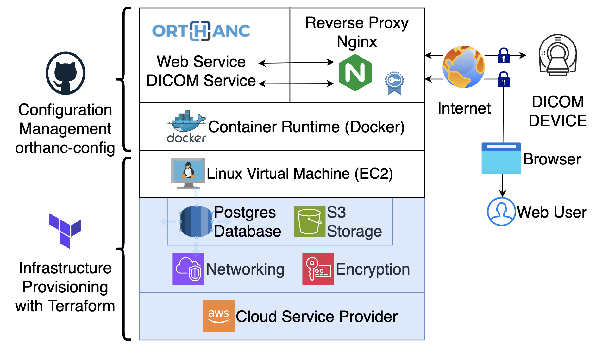

# Orthweb - Orthanc Solution on AWS

## Overview

The **[Orthweb](https://github.com/digihunch/orthweb)** project helps imaging IT staff build an **[Orthanc](https://www.orthanc-server.com/)** solution on AWS. The project addresses the cloud foundation and configuration management to host the Orthanc application. Follow to the [documentation](https://digihunch.github.io/orthweb/) for instructions and architecture discussions. 💪 Let's automate medical imaging!

Imaging systems like Orthanc handle sensitive data and must operate on secure cloud platforms. Typically, large organizations dedicate specialized IT resources to build enterprise-scale cloud foundations. This cloud foundation is known as a [landing zone](https://www.digihunch.com/2022/12/landing-zone-in-aws/). In the landing zone, each business line of the organization is allocated with a segment (e.g. an VPC), to deploy their own applications. 

In reality, many Orthanc users are small teams without overarching cloud strategies from their parent organizations. They are startups, research departments, independent clinics, and so on. They need equally secure and scalable cloud foundations to leverage Orthanc. To close this gap, we propose a cloud-based Orthanc solution to address the cloud foundation and configuration management, and [created](https://www.digihunch.com/2020/11/medical-imaging-web-server-deployment-pipeline/) the **Orthweb** project to implement it. 

  

For cloud foundation, **Orthweb** project uses **Terraform** template (an infrastructure-as-code technology) to provision a self-contained infrastrcture stack in a single AWS account, without relying upon established network infrastructure. The infrastructure layer provisioned in this project contains a single VPC with multiple subnets, along with useful VPC endpoints. The infrastructure layer also contains encryption keys, managed database service and S3 storage. The infrastrcture footprint is small but secure, aiming to comply with regulatory requirements such as HIPPA. However, regulatory auditing is the responsibility of the Orthanc adopter. 

In addition to cloud resource provisioning, the **Orthweb** project also streamles the installation and configuration of Orthanc solution, by proposing a paradign for Orthanc configuration management. The project leverages cloud-init [user data](https://docs.aws.amazon.com/AWSEC2/latest/UserGuide/user-data.html) and `makefile` to configure the servers during the initialization process at the end of cloud resource provisioning. The artifact to install **Orthanc** is stored in the [orthanc-config](https://github.com/digihunchinc/orthanc-config) repository, for users to fork and customize.
  

The project uses the official [Orthanc image](https://hub.docker.com/r/orthancteam/orthanc) and orchestrate the application containers with Docker daemon on EC2 instances. For those considering hosting Orthanc on Kubernetes, check out our sister project [Korthweb](https://github.com/digihunch/korthweb).